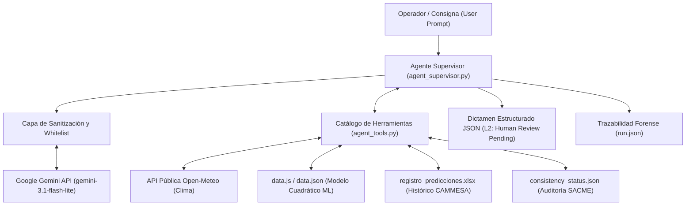

# Arquitectura del Agente Supervisor de Riesgo de Demanda

**Trabajo Final Individual — MBA UCEMA: Programación de y con Agentes de IA**  
**Dominio:** Supervisión Técnica de Demanda Eléctrica en el Área Metropolitana de Buenos Aires (AMBA)

---

## 1. Visión General y Filosofía de Diseño

El sistema está diseñado bajo el principio de **Agencia Pura sin Frameworks Opatos**:
- Se prescinde deliberadamente de librerías como LangChain, CrewAI o AutoGen.
- La orquestación, el ciclo multi-turno de Tool Calling, el parseo estructurado, la sanitización de seguridad y la resiliencia HTTP están implementados directamente en Python estándar (`urllib.request`, `json`, `ssl`).
- El agente opera de forma **completamente aislada y desacoplada del pipeline productivo clásico**, garantizando 100% de operaciones de **solo lectura (read-only)**.

---

## 2. Componentes Principales

### 2.1 Orquestador Agéntico (`agente/agent_supervisor.py`)
Controla el ciclo iterativo de decisión del agente:
1. Recibe la consigna del usuario y compila el contexto con el `SYSTEM_PROMPT` (V0.4).
2. Expone las 3 declaraciones de herramientas mediante el esquema JSON compatible con Gemini API.
3. Gestiona el bucle de razonamiento: hasta un presupuesto máximo de **3 consultas dinámicas**.
4. Valida y sanitiza cada llamada y respuesta de herramienta.
5. Fuerza la emisión final de un objeto JSON estructurado con el dictamen de riesgo operativo.

### 2.2 Catálogo de Herramientas Read-Only (`agente/agent_tools.py`)
1. `consultar_pronostico_y_demanda_estimada`:
   - Conecta a Open-Meteo (API pública) para obtener pronóstico meteorológico oficial (Tmin, Tmax, WeatherCode).
   - Aplica el modelo matemático cuadrático calibrado de SACME para estimar la demanda pico en MW.
2. `consultar_metricas_error_historico`:
   - Analiza el desempeño histórico de predicción a distintos horizontes de anticipación (0 a 6 días) contrastado contra la demanda real publicada por CAMMESA.
   - Informa error medio, MAE, desvío máximo y sesgo sistemático (sobreestimación / subestimación).
3. `consultar_consistencia_datos_base`:
   - Verifica la integridad y continuidad de la serie histórica de SACME, reportando baches o días faltantes.

### 2.3 Resiliencia y Transporte HTTP
- **Timeout por Request:** 90 segundos por petición.
- **TLS Seguro:** Validación estricta y obligatoria de certificados TLS (`ssl.create_default_context()`) contra el almacén de CA de confianza del sistema. No se admiten mecanismos para desactivar la verificación de certificados.

---

## 3. Niveles de Supervisión Humana (Gobierno L2)

El sistema implementa supervisión humana nivel **L2 (Agente Autónomo Asistido)**:
- El agente posee autonomía completa para decidir qué herramientas consultar, en qué orden y cómo formular su dictamen técnico.
- Sin embargo, el dictamen emitido queda formalmente en estado `humanDecision: pending`.
- El agente no tiene autorización para enviar correos, modificar despacho ni alterar ningún archivo de base de datos sin la firma y convalidación de un operador humano.
