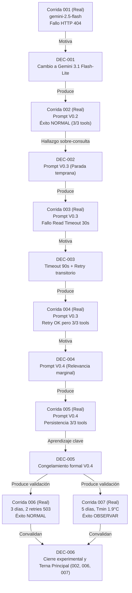

# Matriz de Trazabilidad y Proceso Documentado de Evolución Agéntica (D2)

**Trabajo Final Individual — MBA UCEMA: Programación de y con Agentes de IA**

> **Propósito del Documento:**  
> Demostrar la **trazabilidad completa y sin ambigüedades** del ciclo de vida del agente supervisor, conectando mecánicamente cada problema observado, la evidencia concreta donde ocurrió, la decisión arquitectónica adoptada, los artefactos modificados, la versión resultante y la corrida posterior que validó o refutó dicho cambio.

---

## 1. Matriz Principal de Trazabilidad (DEC-001 a DEC-006)

| Decisión | Problema / Hallazgo | Evidencia Previa | Cambio Decidido | Artefactos Afectados | Versión Resultante | Evidencia Posterior | Resultado |
| :---: | :--- | :--- | :--- | :--- | :---: | :--- | :--- |
| **DEC-001** | `gemini-2.5-flash` devuelve error `HTTP 404: Not Found` por endpoint discontinuado en Google AI Studio v1beta. | [`corrida_001/run.json`](../corridas/evidencia_iteracion/corrida_001/run.json) (Fallo HTTP 404, 0 tools) | Actualizar el modelo oficial a `gemini-3.1-flash-lite`, manteniendo conexión REST pura sin frameworks opacos. | `agente/agent_supervisor.py` `prompts/system_prompt.md` | **V0.2** (`gemini-3.1-flash-lite`) | [`corrida_002/run.json`](../corridas/corrida_002/run.json) | **Éxito:** Function calling multi-turno operativo, dictamen NORMAL y 7.649 tokens. |
| **DEC-002** | Sobre-consulta de herramientas (3/3 consumidas) en escenario rutinario de bajo riesgo, inducida por heurísticas rígidas del prompt. | [`corrida_002/run.json`](../corridas/corrida_002/run.json) (3 calls, consumo marginal) | Reemplazar heurísticas prescriptivas de temperatura por principios generales de investigación y parada temprana. | `prompts/system_prompt.md` `prompts/HISTORIAL_PROMPTS.md` | **V0.3** (`sacme-supervisor-v0.3`) | [`corrida_003/run.json`](../corridas/evidencia_iteracion/corrida_003/run.json) [`corrida_004/run.json`](../corridas/evidencia_iteracion/corrida_004/run.json) | **Sustituida:** V0.3 no resolvió la sobre-consulta ante 1 día (Corrida 004 consumió 3/3 tools). |
| **DEC-003** | Socket Read Timeout a los 30s por latencia y filtros de proxy corporativo en llamadas multi-turno. | [`corrida_003/run.json`](../corridas/evidencia_iteracion/corrida_003/run.json) (Read timed out a los 30.06s) | Aumentar timeout a 90s e implementar política de máximo 1 reintento técnico por solicitud, confinado estrictamente a fallas transitorias de red/servidor (HTTP 429/5xx, timeout). | `agente/agent_supervisor.py` (capa de transporte REST) | **Transporte Robusto** (Timeout 90s + Retry) | [`corrida_004/run.json`](../corridas/evidencia_iteracion/corrida_004/run.json) [`corrida_006/run.json`](../corridas/corrida_006/run.json) | **Éxito / Mantenida:** Máximo 1 reintento técnico por solicitud. La Corrida 006 registró 2 retries totales distribuidos en solicitudes distintas; ninguna solicitud excedió el máximo de 1 retry. |
| **DEC-004** | El System Prompt V0.3 mantiene consumo exhaustivo (3/3 tools) ante consultas simples de 1 día. | [`corrida_004/run.json`](../corridas/evidencia_iteracion/corrida_004/run.json) (3 calls ante horizonte 1d) | Incorporar la **Regla de Justificación Previa para Herramientas Secundarias** basada en relevancia marginal. | `prompts/system_prompt.md` `prompts/HISTORIAL_PROMPTS.md` | **V0.4** (`sacme-supervisor-v0.4`) | [`corrida_005/run.json`](../corridas/evidencia_iteracion/corrida_005/run.json) | **Evaluada:** El LLM persistió en consultar 3/3 tools, evidenciando una estrategia epistémica conservadora nativa. |
| **DEC-005** | Persistencia de 3/3 tools en consultas simples a pesar de la regla de relevancia marginal. | [`corrida_005/run.json`](../corridas/evidencia_iteracion/corrida_005/run.json) (3 calls ante 1 día) | **No continuar sobre-endureciendo el prompt** para no degradar la deliberación agéntica en un árbol determinístico. Congelar V0.4. | `prompts/system_prompt.md` `prompts/HISTORIAL_PROMPTS.md` | **V0.4 Congelada** (Baseline oficial definitivo) | [`corrida_006/run.json`](../corridas/corrida_006/run.json) [`corrida_007/run.json`](../corridas/corrida_007/run.json) | **Éxito / Congelada:** Se demostró consistencia analítica, resiliencia y discriminación sin forzar paradas artificiales. |
| **DEC-006** | Necesidad de validar empíricamente la estabilidad, resiliencia y sensibilidad operativa del baseline congelado V0.4. | [`corrida_006/run.json`](../corridas/corrida_006/run.json) [`corrida_007/run.json`](../corridas/corrida_007/run.json) | Convalidar V0.4 como baseline final y seleccionar la terna de corridas principales para la entrega académica (002, 006, 007). | `docs/CORRIDAS.md` `README.md` `DECISIONES.md` | **Entrega Académica** (V0.4 validada) | [`corridas/corrida_002/`](../corridas/corrida_002/) [`corridas/corrida_006/`](../corridas/corrida_006/) [`corridas/corrida_007/`](../corridas/corrida_007/) | **Éxito:** Terna contrastada con costo incremental USD 0, seguridad PASS y discriminación acreditada. |

---

## 2. Historia Experimental Completa (Paso a Paso 001 → 007)

### Detalle Cronológico por Corrida:

#### 1. Corrida 001 (2026-09-03 15:56:49)
* **Tipo:** Corrida de fallo de API / aprovisionamiento.
* **Configuración:** Modelo `gemini-2.5-flash`, Prompt Pre-V0.3 (heurísticas prescriptivas iniciales), horizonte 3 días.
* **Fallo Observado:** La API REST de Google retornó `HTTPError 404: Not Found` (endpoint de Gemini 2.5 no disponible para proyectos nuevos en AI Studio v1beta).
* **Decisión Resultante (DEC-001):** Cambiar de modelo a `gemini-3.1-flash-lite`. Se preservó `corrida_001/run.json` intacta como evidencia auditable sin fallback opaco.
* **Cambio Aplicado:** Actualización de `CONFIGURED_GEMINI_MODEL = "gemini-3.1-flash-lite"` en `agent_supervisor.py`.

#### 2. Corrida 002 (2026-09-03 16:03:32)
* **Tipo:** Corrida exitosa (convalidación de baseline agéntico).
* **Configuración:** Modelo `gemini-3.1-flash-lite`, Prompt V0.2, horizonte 3 días.
* **Resultado:** Ejecución multi-turno completa exitosa en 8.66 s, 7.649 tokens reales, pico de 4.437 MW, clasificación `NORMAL`, suficiencia `COMPLETA`.
* **Hallazgo:** El agente consumió las 3 herramientas disponibles aun cuando el clima no era extremo y el riesgo era bajo. Las heurísticas del prompt ("si detectas...") sobre-inducían la consulta marginal.
* **Decisión Resultante (DEC-002):** Ratificar `gemini-3.1-flash-lite` y rediseñar el prompt hacia principios de investigación y parada temprana (V0.3).
* **Cambio Aplicado:** Eliminación de reglas rígidas y publicación de `sacme-supervisor-v0.3`.

#### 3. Corrida 003 (2026-09-03 16:12:45)
* **Tipo:** Corrida de fallo de transporte de red.
* **Configuración:** Modelo `gemini-3.1-flash-lite`, Prompt V0.3, timeout 30s, horizonte 1 día.
* **Fallo Observado:** Socket Read Timeout a los 30.06 s (`The read operation timed out`) producto de la inspección y latencia del proxy corporativo.
* **Decisión Resultante (DEC-003):** Robustecer el transporte HTTP extendiendo el timeout a 90 s e incorporando un único reintento técnico para fallos transitorios (HTTP 429/5xx, timeout).
* **Cambio Aplicado:** Incorporación de `timeout_seconds = 90` y bloque de retry en `agent_supervisor.py`.

#### 4. Corrida 004 (2026-09-03 16:19:17)
* **Tipo:** Corrida de contingencia y diagnóstico agéntico.
* **Configuración:** Modelo `gemini-3.1-flash-lite`, Prompt V0.3, timeout 90s, retry máx 1, horizonte 1 día.
* **Resultado Técnico:** Completó las 3 tool calls; la política de retry detectó y recuperó un `HTTP 503` en la iteración 1, pero una caída posterior en el dictamen final interrumpió la corrida (4.865 tokens consumidos).
* **Hallazgo Agéntico:** Ante un escenario de 1 solo día con 12.6°C y demanda baja, el agente volvió a invocar las 3 herramientas. Los principios generales de V0.3 fueron insuficientes.
* **Decisión Resultante (DEC-004):** Diseñar V0.4 introduciendo la **Regla de Justificación Previa para Herramientas Secundarias** (relevancia marginal explícita).
* **Cambio Aplicado:** Actualización del contrato formal a `sacme-supervisor-v0.4`.

#### 5. Corrida 005 (2026-09-03 16:25:22)
* **Tipo:** Corrida de diagnóstico y límite de optimización.
* **Configuración:** Modelo `gemini-3.1-flash-lite`, Prompt V0.4, horizonte 1 día.
* **Resultado:** El agente volvió a consultar 3/3 herramientas antes de que un HTTP 503 interrumpiera el dictamen (4.976 tokens).
* **Aprendizaje Fundamental:** Forzar al LLM mediante más texto prescriptivo a detenerse temprano destruye la agencia deliberativa y lo convierte en un árbol determinístico rígido.
* **Decisión Resultante (DEC-005):** **Congelar formalmente la versión V0.4 (`sacme-supervisor-v0.4`)** como baseline definitivo y evaluar el agente ante escenarios de demanda variados sin restringir artificialmente las consultas.

#### 6. Corrida 006 (2026-09-03 16:30:02)
* **Tipo:** Corrida exitosa (validación de resiliencia de transporte).
* **Configuración:** Modelo `gemini-3.1-flash-lite`, Prompt V0.4 congelado, horizonte 3 días.
* **Resultado:** Dictamen estructurado emitido exitosamente (`NORMAL`, 4.508 MW, 8.069 tokens).
* **Comprobación de Resiliencia:** El orquestador opera bajo la política de **máximo 1 reintento técnico por solicitud**. La Corrida 006 registró 2 retries totales distribuidos en solicitudes distintas (iteración 1 y generación del dictamen final); ninguna solicitud excedió el máximo de 1 retry.
* **Aporte:** Demostración empírica de robustez operativa de transporte sin intervención humana ante dos eventos transitorios `HTTP 503: Service Unavailable`.

#### 7. Corrida 007 (2026-09-03 16:32:58)
* **Tipo:** Corrida exitosa (validación de discriminación y sensibilidad técnica).
* **Configuración:** Modelo `gemini-3.1-flash-lite`, Prompt V0.4 congelado, horizonte 5 días (ola polar).
* **Resultado:** Dictamen estructurado emitido exitosamente (`OBSERVAR`, 5.006 MW, Tmin 1.9°C, 8.756 tokens, 0 retries, latencia 33.9 s).
* **Comprobación de Sensibilidad:** Ante una demanda estimada proyectada superior a 5.000 MW y temperaturas críticas con inercia térmica, el agente conmutó su clasificación de `NORMAL` a `OBSERVAR`, fundamentando técnicamente la combinación de frío y el sesgo de sobreestimación del modelo.
* **Decisión Resultante (DEC-006):** Cierre formal del ciclo experimental y declaración de la **Terna Principal de Corridas Académicas (002, 006, 007)**.

---

## 3. Taxonomía Integral de las 7 Corridas

| Categoría de Corrida | Corridas Pertenecientes | Función en el Proyecto | Ubicación en el Repositorio |
| :--- | :---: | :--- | :--- |
| **Corridas de Fallo y Contingencia** | **001, 003, 004, 005** | Documentar resiliencia ante caídas de API (404, 503), timeouts de red y límites de parada temprana. | [`corridas/evidencia_iteracion/`](../corridas/evidencia_iteracion/) |
| **Corridas Exitosas con Dictamen Completo** | **002, 006, 007** | Demostrar funcionamiento agéntico de punta a punta, salida estructurada JSON válida y supervisión L2. | [`corridas/corrida_002/`](../corridas/corrida_002/) [`corridas/corrida_006/`](../corridas/corrida_006/) [`corridas/corrida_007/`](../corridas/corrida_007/) |
| **Terna de Corridas Principales de Evaluación** | **002, 006, 007** | Terna contrastada seleccionada para la evaluación académica del MBA UCEMA (Baseline, Resiliencia y Discriminación). | Directorios dedicados con `input.json`, `output.json` y `metadata.json`. |

---

## 4. Trazabilidad de Versiones de Prompt

| Versión | Denominación en Código | Motivación de Diseño | Decisión que la Origina | Corridas Asociadas | Estado |
| :---: | :--- | :--- | :---: | :---: | :---: |
| **Pre-V0.3** | *Pre-V0.3* (Prototipo Inicial) | Prototipo inicial con heurísticas prescriptivas rígidas por temperatura. | Baseline inicial | **Corrida 001** | Obsoleta (Fallo HTTP 404 en Gemini 2.5) |
| **V0.2** | `sacme-supervisor-v0.2` | Adaptación de function calling nativo para Gemini 3.1 Flash-Lite. | **DEC-001** | **Corrida 002** | Sustituida (Inducía sobre-consulta de tools) |
| **V0.3** | `sacme-supervisor-v0.3` | Reemplazo de heurísticas por principios generales de parada temprana. | **DEC-002** | **Corrida 003**, **Corrida 004** | Sustituida (No resolvió sobre-consulta ante 1d) |
| **V0.4** | `sacme-supervisor-v0.4` | Regla de Justificación Previa de Relevancia Marginal para herramientas secundarias. | **DEC-004** / **DEC-005** | **Corrida 005**, **Corrida 006**, **Corrida 007** | **Congelada (Baseline Oficial Definitivo)** |

---

## 5. Cadena de Custodia Criptográfica (Inmutabilidad de Hashes SHA-256)

La integridad de cada paso del proceso experimental está garantizada por las firmas criptográficas de sus respectivos archivos de auditoría primaria `run.json`:

* **Corrida 001:** `42f8346e2b2f0f8d7fc8e8a2bd605197275307b03d6cb7cbb5a7ef41bdafdf85`
* **Corrida 002:** `cd2561ba4acafd92f3be088f5615ae1aca7017808bf7f3f296ba85793dfb04a7`
* **Corrida 003:** `25ec64ba046861e4afdabe49483039a876947771393b8d2c3926b0a6a97636b5`
* **Corrida 004:** `ff6f229e1652dd53726a80ae0bb8ee15af4640b77cf4cee1e267582235fa8133`
* **Corrida 005:** `425319699cbaeaee5999fab93b8c8c55c292137347dbdb3d71eeeb193638789a`
* **Corrida 006:** `c282f6416a8f37948dc6b06d602071b8bd03a8a3931ad703b7a7cc66e5bd092c`
* **Corrida 007:** `21719d6e2d938dc870ba125b136e5a891e62cf30263a9c42d0dc56736dfeee1f`
